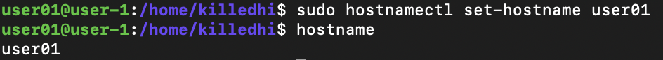
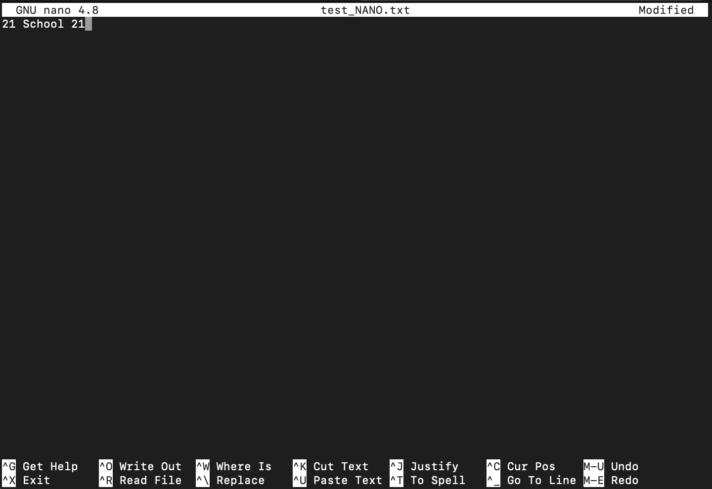
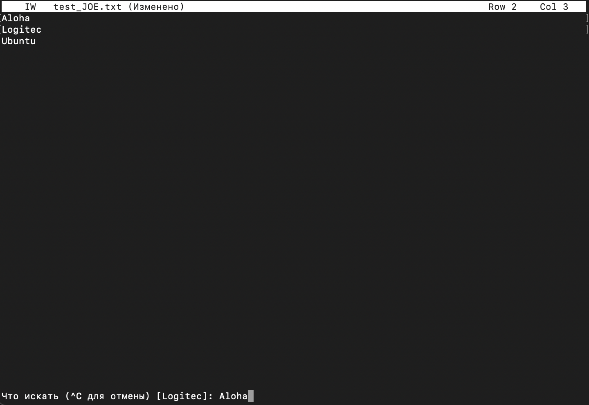
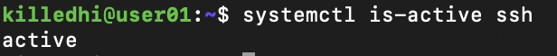
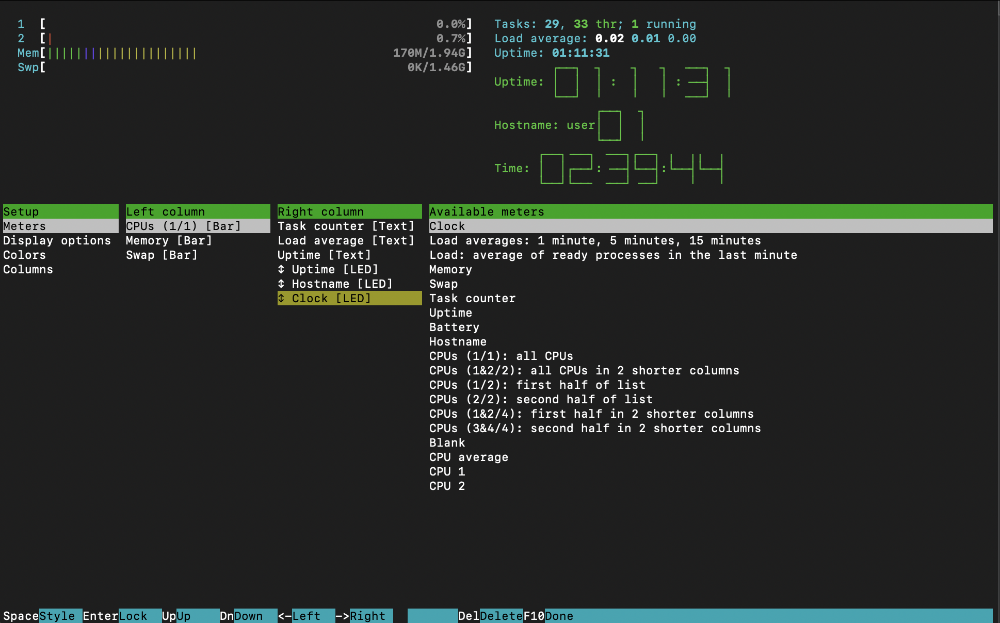
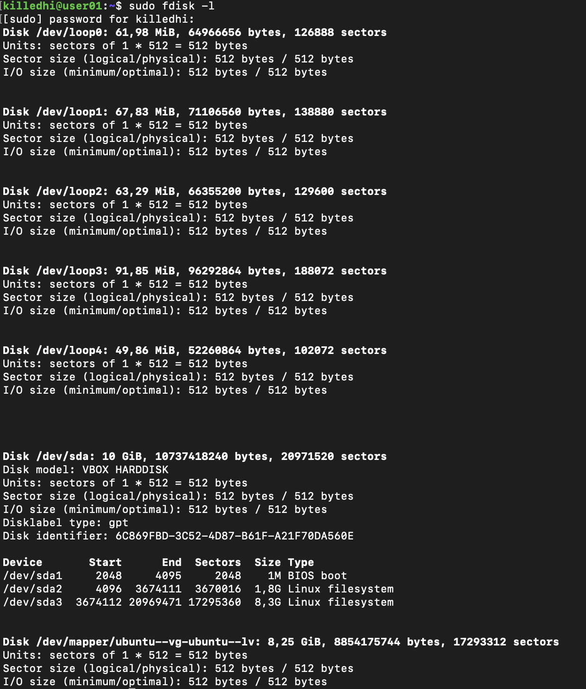
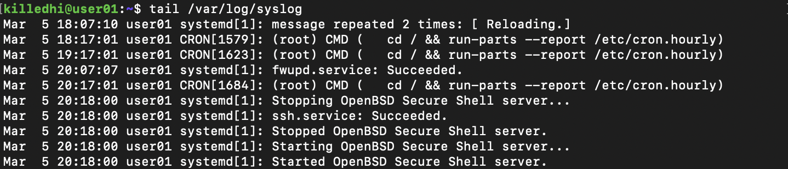
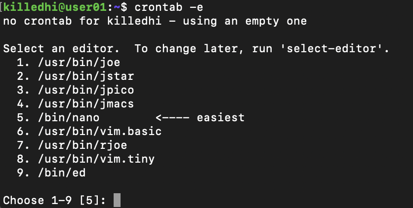

# UNIX/Linux

## Part 1. Установка OC
___
* Узнать версию Ubuntu, выполнив команду 
`cat /etc/issue`

## Part 2. Создание пользователя
___
* Вызвать команду для создания пользователя 

* Добавить нового пользователя в группу 'adm' с помощью команды `sudo usermod -a -G adm user01`, где adm - название группы, а user - имя пользователя

* Ввод команды `cat /etc/passwd` для отображения списка учётных записей системы
 

## Part 3. Настройка сети ОС
___
* Задать название машины вида user-1  
Используем команду `sudo hostnamectl set-hostname user01`  
Проверяем изменения командой `hostname`

* Установить временную зону, соответствующую вашему текущему местоположению  
Исползуем команду `sudo timedatectl set-timezone Europe/Moscow`  
Проверяем время командами `timedatectl` или `date`

* Вывести названия сетевых интерфейсов с помощью консольной команды  
  Для работы с сетевым окружением в ubuntu используется утиллита net-tools.  
  Установим её командой `sudo apt install net-tools`  
  Теперь можно посмотреть нашу сеть командами `ifconfig` `ip link show`

Интерфейс lo (loopback device) – виртуальный интерфейс, присутствующий по умолчанию в любом Linux.  
Он используется для отладки сетевых программ и запуска серверных приложений на локальной машине.

* Получить ip адрес устройства, на котором вы работаете, от DHCP сервера  
  Сначала сбрасываем старый ip командой `sudo dhclient -r`  
 Получим новый командой `sudo dhclient -v`

  
  

  Команда `ip address` применяется для назначения адресов и маски данному интерфейсу.  
-d Заставить dhclient работать как процесс переднего плана.  
DHCP (Dynamic Host Configuration Protocol ) - протокол динамической настройки узла - прикладной протокол, 
позволяющий сетевым устройствам автоматически получать IP-адрес и другие параметры,
необходимые для работы в сети TCP/IP. Протокол работает по модели "клиент-сервер"

* Получить внутренний ip - адрес шлюза (gw)  
Вводим команду `ip r`

  

* Получить внешний ip-адресс  
С помощью команды `wget -O - -q icanhazip.com` узнаём адресс

  

* Задать статичные (заданные вручную, а не полученные от DHCP сервера) настройки ip, gw, dns 
(использовать публичный DNS серверы, например 1.1.1.1 или 8.8.8.8).  
Вводим команду `sudo vim /etc/netplan/00-installer-config.yaml`

Сохранить изменения
* Перезагрузить виртуальную машину.
Перезагрузить виртуальную машину c помощью команды `sudo reboot`.

* Убедиться, что статичные сетевые настройки (ip, gw, dns) соответствуют заданным в предыдущем пункте командой `ip route`

* Успешно пропинговать удаленные хосты 1.1.1.1 и ya.ru и вставить в отчёт скрин с выводом команды.  
Используем команды `ping -c 4 ya.ru` и `ping -c 4 1.1.1.1` соответсвенно.  
В выводе команды должна быть фраза "0% packet loss".

## Part 4. Обновление ОС

* Обновить системные пакеты до последней на момент выполнения задания версии
 Изначально обновляем список репозиториев `sudo apt upgrade`

Обновляеем версии пакетов командой `sudo apt dist-upgrade`, подтверждаем изменения.
Повторно используем команду `sudo apt dist-upgrade` чтобы убедиться, что обновления отсутсвуют. 

## Part 5. Использование команды sudo

*    Oбъяснить истинное назначение команды sudo (про то, что это слово - "волшебное", писать не стоит)  
  `sudo` - команда, которая позволяет определенным пользователям выполнять указанные программы с административными привелегиями без ввода пароля root (пользователя с повышенным правом).

* Разрешить пользователю, созданному в Part 2, выполнять команду sudo.  
 Создаём файл нашего пользователя командой `sudo touch /etc/sudoers.d/user01`  
 Открываем его с помощью текстового редактора "nano" командой `sudo nano /etc/sudoers.d/user01`

Записываем туда следующую строку: `user01 ALL=(ALL:ALL) ALL`   

Где `user01` ALL=(ALL:ALL) ALL Первое поле показывает имя пользователя, которое правило будет применять к (user01).  
user01 `ALL`=(ALL:ALL) ALL Первое “ALL” означает, что данное правило применяется ко всем хостам.  
user01 ALL=(`ALL`:ALL) ALL Данное “ALL” означает, что пользователь user01 может запускать команды от лица всех пользователей.  
user01 ALL=(ALL:`ALL`) ALL Данное “ALL” означает, что пользователь user01 может запускать команды от лица всех групп.  
user01 ALL=(ALL:ALL) `ALL` Последнее “ALL” означает, что данные правила применяются всем командам.  

Сохраняем изменения, выходим из файла. Заходим под пользователем user01 используя команду `su user01`, проверяем работу sudo командой `sudo apt update`.  

* Поменять hostname ОС от имени пользователя, созданного в пункте Part 2 (используя sudo)

Устанавливаем имя хоста "user01" используя команду `sudo hostnamectl set-hostname user01`.   
Проверяем изменился hostname или нет командой `hostname`.   

## Part 6. Установка и настройка службы времени

*Настроить службу автоматической синхронизации времени

- Вывести время, часового пояса, в котором вы сейчас находитесь.
- Вывод следующей команды должен содержать NTPSynchronized=yes:
  timedatectl show
- Вставить скрины с корректным временем и выводом команды в отчёт.  
Вводим команду `time datatectl show`

## Part 7. Установка и использование текстовых редакторов

* Установить текстовые редакторы VIM (+ любые два по желанию NANO, MCEDIT, JOE и т.д.)

Выбрал и установил VIM, NANO, JOE.  

Для установки VIM требуется команда `sudo apt install vim`.  
Для установки NANO требуется команда `sudo apt install nano`.  
Для установки JOE требуется команда `sudo apt install joe`.  

### VIM

* Создать файл test_X.txt, где X -- название редактора, в котором создан файл. 

* Напишите в нём свой никнейм, закройте файл с сохранением изменений. 

* Для начала редактирования необходимо нажать клавишу `i`.  
* Для выхода с сохранением нажать клавишу `ESC`, ввести `:wq`.

* Используя каждый из трех выбранных редакторов, откройте файл на редактирование, отредактируйте файл, 
* Заменив никнейм на строку "21 School 21", закройте файл без сохранения изменений.  
  Для выхода без сохранения VIM нажать клавишу `ESC`, ввести `:q!`.  

* Используя каждый из трех выбранных редакторов, отредактируйте файл ещё раз (по аналогии с предыдущим пунктом), 
а затем освойте функции поиска по содержимому файла (слово) и замены слова на любое другое.  
  Поиск слова VIM.  
* Нажать клавишу `ESC`, ввести `:/исходное слово`

Замена слова на другое VIM.  
* Нажать клавишу `ESC`, ввести `:%s/исходное слово/новое слово/g`

### NANO

* Создать файл test_X.txt, где X -- название редактора, в котором создан файл. 
 

* Напишите в нём свой никнейм, закройте файл с сохранением изменений
  Для выхода с сохранением зажать клавишу `comtrol` + `X`, подтвердить изменения клавишей `Y`, нажать `Enter`.

* Используя каждый из трех выбранных редакторов, откройте файл на редактирование, 
* отредактируйте файл, заменив никнейм на строку "21 School 21", закройте файл без сохранения изменений.

Для выхода без сохранения зажать клавишу `comtrol` + `X`, отменить изменения клавишей `N`, нажать `Enter`.

* Используя каждый из трех выбранных редакторов, отредактируйте файл ещё раз (по аналогии с предыдущим пунктом), 
а затем освойте функции поиска по содержимому файла (слово) и замены слова на любое другое.  
Поиск слова  
* Для поиска слова зажать клавишу `comtrol` + `X`, ввести нужное слово в строке Search. Нажать `Enter`. 
На нужном слове будет установлен указатель.

Замена слова на другое
Для замены слова зажать клавишу `comtrol` + `\`, ввести нужное слово в строке "Search(to replace)". Нажать `Enter`.

Ввести слово на замену в строке "Replace with". Нажать `Enter`.  

Подтвердить замену клавишей `Y`, нажать `Enter`.  

### JOE

* Создать файл test_X.txt, где X -- название редактора, в котором создан файл. 

* Напишите в нём свой никнейм, закройте файл с сохранением изменений
  Для выхода с сохранением нажмите `control` + `K`, а затем клавишу `Q`. После подтвердить изменения клавишей `Y`.

* Используя каждый из трех выбранных редакторов, откройте файл на редактирование, отредактируйте файл, 
* заменив никнейм на строку "21 School 21", закройте файл без сохранения изменений.  
  Для выхода без сохранения нажмите `control` + `K`, а затем клавишу `Q`. После отказаться от изменения клавишей `N`.

* Используя каждый из трех выбранных редакторов, отредактируйте файл ещё раз (по аналогии с предыдущим пунктом), 
* а затем освойте функции поиска по содержимому файла (слово) и замены слова на любое другое.  
  Поиск слова
  Для поиска слова нужно нажать `control` + `K` и клавишу `F`. Ввести искомое слово, нажать `Enter`.

Ещё раз нажать клавишу `Enter`.

Курсор мереместиться к искомому слову  

Замена слова
* Для замены слова нужно нажать `control` + `K` и клавишу `F`. Ввести искомое слово, нажать `Enter`.

Ввести слово для замены в строку  "Чем заменить".  

Выделится слово для замены. Нажать клавишу `Y`.

Искомое слово заменилось новым.  

## Part 8. Установка и базовая настройка сервиса SSHD

* Устанавливаем ssh на рабочую машину с помощью команды 
`sudo apt install openssh-server`  

* При установке SSH-сервер автоматически прописывается в автозагрузку. 
Управлять его запуском, остановкой или перезапуском можно с помощью команд 
`sudo systemctl start|stop|restart ssh`

* Проверить, что служба "ssh.service" работает командой 
`systemctl is-active ssh`

* Добавляем службу sshd в автозапуск, делаем это с помощью команды
`sudo systemctl enable ssh`

* Перенастроить службу SSHd на порт 2022
  Чтобы перенастроить службу SSHd на порт 2022 открываем файл "sshd_config" командой `sudo vim /etc/ssh/sshd_config`
* и меняем 22 на 2022.

* Используя команду ps, показать наличие процесса sshd. Для этого к команде нужно подобрать ключи.
  В отчёте объяснить значение команды и каждого ключа в ней. Используем команду `ps aux | grep sshd`

ps - встроенная программа, с помощью которой осуществляется мониторинг активных процессов по виртуальным файлам в файловой системе.
Данная программа позволяет ориентироваться в том, что конкретно происходит в Linux;  
-А - выводит все процессы;  
-а - выводит все процессы в текущем терминале;  
-u - выводит процессы, запушенные пользователем root;  
-x - выводит список всех активных процессов;  
-С - выводит процессы по имени команды  

* Чтобы изменения вступили в силу необходимо перезапустить систему командой
  `sudo systemctl restart sshd`

* Выводим статус командой `systemctl status sshd`

* Результат выполнения можно увидеть введя команду `netstat -tan`.

-t отобразит только TCP;  
-a покажет все сокеты(слушаемые и нет);  
-n будет показывает численные адрес;
Proto - Содержит тип протокола;  
Recv-Q - Счётчик байтов не скопированных программой пользователя из этого сокета;  
Send-Q - Счётчик байтов, не подтверждённых удалённым узлом;  
Local Address - Адрес и номер порта локального конца сокета;  
Foreign Address - Адрес и номер порта удалённого конца сокета;  
State - Состояние сокета;  
LISTEN Сокет ожидает входящих подключений;  
SYN_SENT Сокет, находящийся в режиме активной попытки установки подключения;  
0.0.0.0 - это немаршрутизируемый адрес IPv4, который используется в качестве адреса по умолчанию или адреса-заполнителя;

## Part 9. Установка и использование утилит top, htop
* Установить и запустить утилиты top и htop
* Установка утилиты "top" выполняется командой `sudo apt install top`
* Запуск утилиты "top" производится командой `top`

В верхней части находится информация о системе, 
общем использовании ресурсов процессора и памяти, раздела подкачки, и т.д.  
В нижней части окна расположен список запущенных процессов с информацией, отсортированных по определённому полю.

* Вывод с команды `top`  
Uptime up 59 min  
Количество авторизованных пользователей 1 user  
Общую загрузку системы 0,00, 0,00, 0,00  
Общее количество процессов 106 total  
Загрузку cpu 0.0  
Загрузку памяти MiB Mem 1983,2 MiB Swap 1499,0  
Pid процесса занимающего больше всего памяти 741  
Pid процесса, занимающего больше всего процессорного времени 1root  

* Установка утилиты "htop" выполняется командой `sudo apt install htop`

* Запуск утилиты "htop" производится командой `htop`

* Для того чтбы отсортировать данные используем клавишу `F6`
* Скрины с сротировкой процессов по:
PID

PERCENT_CPU

PERCENT_MEM

TIME

Для фильтрации процесса по sshd используем клавишу меню `F4`. Вводим в сроку  Filter `sshd`.  

Для фильтрации используем клавишу меню `F3`. Вводим в сроку  Search `syslog`.

Для добавления hostname, clock и uptime нажимаем `F2` и в настройках добавляем необходимые атрибуты на дашборд утилиты.

## Part 10. Использование утилиты fdisk

* Устанавливаем утилиту командами `sudo apt update` и `sudo apt install fdisk`.
  Команда fdisk позволяет задействовать одноименную утилиту для модификации таблиц разделов жестких дисков формата MSDOS.
* Запускаем утилиту командой `sudo fdisk -l`.

название жесткого диска  /dev/sda
размер 10 G
количество секторов 20971520
размер swap с помощью команды `swapon --show`
размер swap 1.5 G

## Part 11. Использование утилиты df

* df  
Размер раздела 8408452 KB  
Размер занятого пространства 4263240 KB  
Размер свободного пространства 3696496 KB  
Процент использования 54%  

* df -Th  
Размер раздела 8,1G  
Размер занятого пространства 4,1G  
Размер свободного пространства 3,6G  
Процент использования 54%  
Тип файловой системы для раздела ext4  

## Part 12. Использование утилиты du

*Для запуска утилиты do нужно ввести команду `do`.
* Вывести размер папок /home, /var, /var/log(в байтах, в человекочитаемом виде) c использованием команды 
`sudo du -s --block-size=1 /var/log /var /home`.  
-s, --summarize - выводить только общий размер;  
-B, --block-size - указать единицы вывода размераю.

* В человекочитаемом виде используя команду `sudo du -sh /var/log /var /home`.  
-h, --human-readable - выводить размер в единицах измерения удобных для человека;

 

* Вывести размер всего содержимого в /var/log используя команду `sudo du /var/log/*`.

 

## Part 13. Установка и использование утилиты ncdu
* Установить утилиту ncdu. 
* Используем команду `sudo apt install ncdu`

 

* Вывести размер папок /home, /var, /var/log. Нужно ввести следущие команды:

  

* /home
  
* /var
  
* /var/log
  

## Part 14. Работа с системными журналами

* Для удобства воспользуемся командой `tail`, она показывает последние десять строк файла.
* /var/log/dmesg
  
* /var/log/syslog
  
* /var/log/auth.log
  

- время последней успешной авторизации 19:46:40
- имя пользователя killedhi
- метод входа в систему pam_unix
  
* Перезапустить службу SSHd `sudo service ssh restart`
  
* Вставить в отчёт скрин с сообщением о рестарте службы (искать в логах).  
Вводим команду `tail /var/log/syslog`
  

  ## Part 15. Использование планировщика заданий CRON

* Используя планировщик заданий, запустите команду uptime через каждые 2 минуты
  Вызываем `crontab -e`, выбираем редактор.  
* crontab -e	Редактирование или создание файла расписания для текущего пользователя;  
* crontab -l	Вывод содержимого расписания текущего пользователя;  
* crontab -r	Удаление файла расписания текущего пользователя;  
* crontab -u user	Работа с расписаниями конкретных пользователей.

  
  внизу под комментариями вставляем следующую строку:
`*/2 * * * * uptime | wall`
  

- строчки о выполнении
  `cat /var/log/syslog`
  

- cписок текущих заданий для CRON
  `crontab -l`

  

* Удалите все задания из планировщика заданий
  `crontab -r`
  проверить
  `crontab -l`

  

